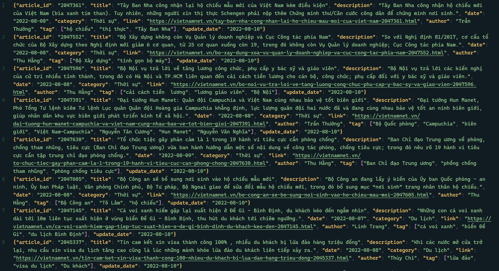
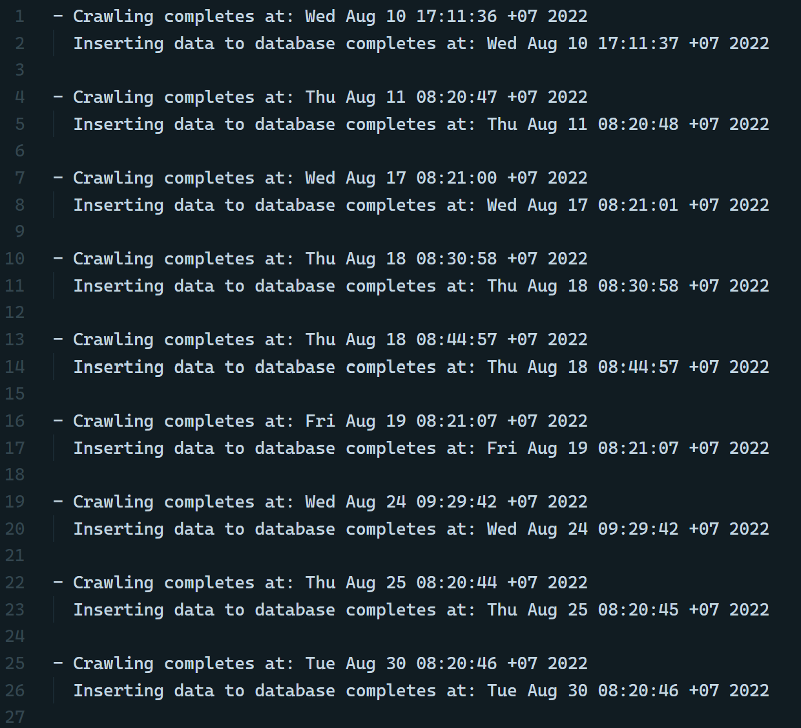

# Crawl data VietNamNet

This is my project from my time in university. This project include: Extract data from VietNamNet, perform appropriate Transformations, and Load into `MySQL`.

Technologies used:
- Language: `Python`
- Crawl data tool: `Scrapy`
- Database: `MySQL`
- Database toolkit (ORM): `SQLAlchemy`
- Scheduling tool: `cron`


## Things that I did
Database design: [Link](https://dbdiagram.io/d/VietNamNet_DB-65e0a537cd45b569fb39acaa).

For crawling data, I use Scrapy for pull the articles from [VietNamNet](https://vietnamnet.vn/): start from the home page, I extract all the category links then follow them. Next, I only follow the articles' link in the **1st page**, and crawl them. The fields I crawl from each article can be seen below. Eventually, data crawled by the day are stored in `output` folder.
```
data = {
    'article_id': ...
    'title': ...
    'description': ...
    'date': ...
    'category': ...
    'link': ...
    'author': ...
    'tag': ...
    'update_date': ...
}
```

For database (in `database` folder), I connect to `MySQL` and create schema by `SQLAlchemy`. Data is inserted by reading crawled data. If it already existed, it's simply skipped. For this reason, database consists of only distinct records.

Finally, for daily crawl, I use `cron` command in Linux for scheduling. Daily crawl starts at 8:20 AM (GMT+7). `check.txt` file let me know the time of job completion.


## Results


